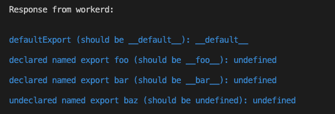

# workerd-namedExports-capnp-repro

Reproduction of the workerd cjs modules `namedExports` capnp module configuration.

## Reproduction steps

Install the dependencies:

```
$ npm i
```

run:

```
$ npm start
```

see the command's output

<details>
<summary>what I currently get</summary>



</details>
